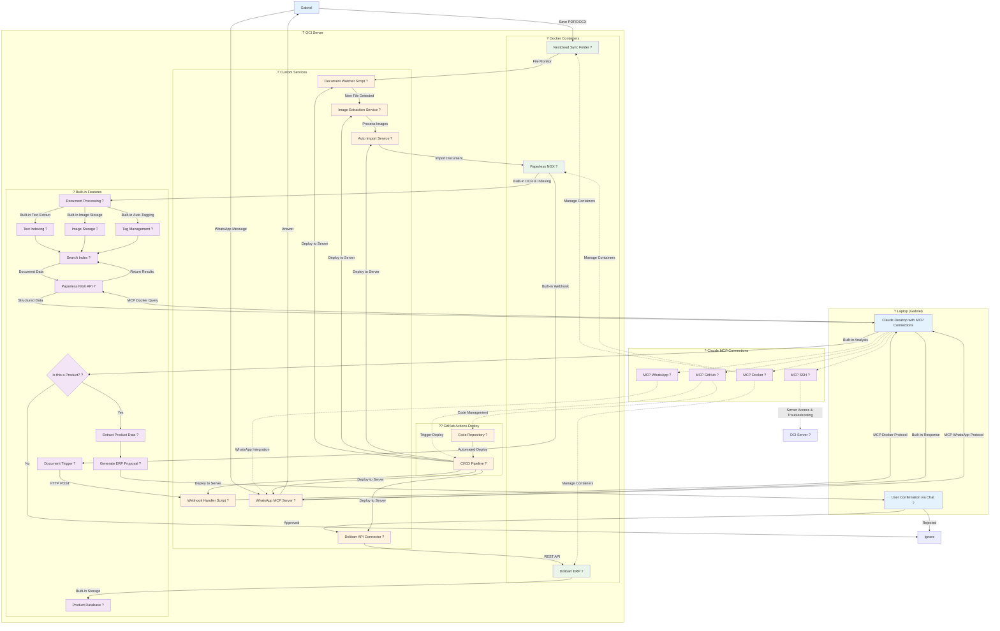

# NauticParts - AI-Powered Document Management System

An intelligent document management system for nautical parts with automated AI processing, built on Paperless NGX, Claude AI integration, and ERP synchronization.

## Architecture Overview

```
Gabriel ? Nextcloud ? Auto Processing ? Paperless NGX ? Claude AI ? Dolibarr ERP
             ?             ?             ?          ?
       File Sync    Image Extract    OCR/Index   Product ID    ? WhatsApp
```

## Detailed Workflow Diagram



### Workflow Legend

| Symbol | Component Type | Description |
|--------|---------------|-------------|
| ? | **Client PC** | Gabriel's laptop with Claude Desktop |
| ? | **Docker Containers** | Core applications on OCI server |
| ? | **Custom Services** | Python/Node.js scripts we develop |
| ? | **Built-in Features** | Native functionality of tools |
| ? | **MCP Connections** | Claude Desktop integrations |

## Features

- **Automatic Document Processing**: PDF/DOCX files are automatically processed and imported
- **Image Extraction**: Automatically extracts product images from documents
- **AI Product Recognition**: Claude AI identifies and extracts product information
- **WhatsApp Integration**: Query documents and manage products via WhatsApp
- **ERP Integration**: Automatic product creation in Dolibarr ERP system
- **Containerized Deployment**: Complete Docker-based infrastructure

## Components

### Core Applications (Docker Containers)
- **Nextcloud**: File synchronization and storage
- **Paperless NGX**: Document management and OCR
- **Dolibarr**: ERP system for product management
- **Redis**: Caching and queue management
- **PostgreSQL/MariaDB**: Database systems

### Custom Services
- **Document Watcher**: Monitors for new files and triggers processing
- **Image Extractor**: Extracts images from PDF/DOCX documents
- **Webhook Handler**: Processes Paperless NGX webhooks and communicates with Claude
- **Dolibarr Connector**: Creates products in ERP system
- **WhatsApp MCP**: Enables WhatsApp communication with Claude AI

### Built-in Tool Features
- **Paperless NGX**: OCR, indexing, tagging, webhooks, search API
- **Claude Desktop**: Document analysis, decision making, data extraction, response generation
- **Dolibarr ERP**: Product storage, REST API, database management
- **Nextcloud**: File synchronization, storage

## Quick Start

### Prerequisites
- Docker and Docker Compose
- Claude Desktop with MCP configuration
- OCI Server or similar Linux server

### Installation

1. **Clone Repository**
   ```bash
   git clone https://github.com/latinogino/nauticparts.git
   cd nauticparts
   ```

2. **Setup Environment**
   ```bash
   cp .env.example .env
   # Edit .env with your secure passwords and configuration
   ```

3. **Deploy Services**
   ```bash
   docker-compose up -d
   ```

4. **Configure Claude Desktop MCP**
   Add to your Claude Desktop configuration:
   ```json
   {
     "mcpServers": {
       "docker": {
         "command": "docker-mcp-server",
         "args": ["--host", "your-oci-server"]
       },
       "github": {
         "command": "github-mcp-server",
         "args": ["--repo", "latinogino/nauticparts"]
       },
       "whatsapp": {
         "command": "whatsapp-mcp-server",
         "args": ["--api-url", "http://your-oci-server:3001"]
       },
       "ssh": {
         "command": "ssh-mcp-server", 
         "args": ["--host", "your-oci-server"]
       }
     }
   }
   ```

## Usage

### Document Processing
1. Save PDF/DOCX files to your Nextcloud sync folder
2. Files are automatically processed and imported to Paperless NGX
3. Claude AI analyzes documents for product information
4. Receive confirmation prompts via Claude Desktop or WhatsApp
5. Approved products are automatically created in Dolibarr ERP

### WhatsApp Queries
- *"Search for bearing part 12345"*
- *"Show me all engine documentation"*
- *"Create product proposal for new pump"*

### System Management via Claude Desktop
- *"Show me Paperless NGX container logs"* ? MCP Docker
- *"Deploy latest code changes"* ? MCP GitHub  
- *"Check OCI server disk usage"* ? MCP SSH
- *"Send status update via WhatsApp"* ? MCP WhatsApp

## Directory Structure

```
nauticparts/
??? docker-compose.yml          # Main orchestration file
??? .env.example               # Environment template
??? services/                  # Custom service implementations
?   ??? document-watcher/      # File monitoring service
?   ??? image-extractor/       # PDF/DOCX image extraction
?   ??? webhook-handler/       # Paperless webhook processor
?   ??? dolibarr-connector/    # ERP integration service
?   ??? whatsapp-mcp/         # WhatsApp MCP server
??? config/                    # Configuration files
??? .github/workflows/         # CI/CD automation
??? docs/                     # Additional documentation
```

## Service Configuration

### Required Environment Variables

| Variable | Description |
|----------|-------------|
| `NEXTCLOUD_DB_PASSWORD` | Nextcloud database password |
| `PAPERLESS_DB_PASSWORD` | Paperless NGX database password |
| `PAPERLESS_SECRET_KEY` | Paperless NGX secret key (50+ chars) |
| `PAPERLESS_API_TOKEN` | Paperless NGX API token |
| `DOLIBARR_DB_PASSWORD` | Dolibarr database password |
| `DOLIBARR_ADMIN_PASSWORD` | Dolibarr admin password |
| `DOLIBARR_API_KEY` | Dolibarr API key |
| `CLAUDE_MCP_URL` | Claude MCP webhook URL |

### Service Endpoints

| Service | Port | Purpose |
|---------|------|---------|
| Nextcloud | 8080 | File management interface |
| Paperless NGX | 8000 | Document management |
| Dolibarr | 8090 | ERP interface |
| Webhook Handler | 3000 | Claude integration |
| WhatsApp MCP | 3001 | WhatsApp communication |

## Development

### Local Development
```bash
# Start development environment
docker-compose -f docker-compose.dev.yml up -d

# View logs
docker-compose logs -f service-name

# Rebuild specific service
docker-compose build service-name
```

### Deployment
Push to main branch triggers automatic deployment via GitHub Actions to OCI server.

### Required GitHub Secrets
- `OCI_HOST`: Server IP address
- `OCI_USER`: Server username  
- `OCI_SSH_KEY`: SSH private key for server access

## Workflow Process

1. **Document Upload**: Gabriel saves PDF/DOCX to Nextcloud folder
2. **File Monitoring**: Document watcher detects new files
3. **Image Extraction**: Extract images before Paperless import
4. **Auto Import**: Files moved to Paperless NGX consume folder
5. **OCR Processing**: Paperless NGX processes documents
6. **AI Analysis**: Claude analyzes via webhook for product data
7. **User Confirmation**: Approval via Claude Desktop or WhatsApp
8. **ERP Creation**: Approved products created in Dolibarr

## Support

- [Documentation](./docs/)
- [Issues](https://github.com/latinogino/nauticparts/issues)
- [Discussions](https://github.com/latinogino/nauticparts/discussions)

## License

MIT License - see [LICENSE](LICENSE) for details.

---

**NauticParts** - Streamlining nautical parts management with AI-powered automation.