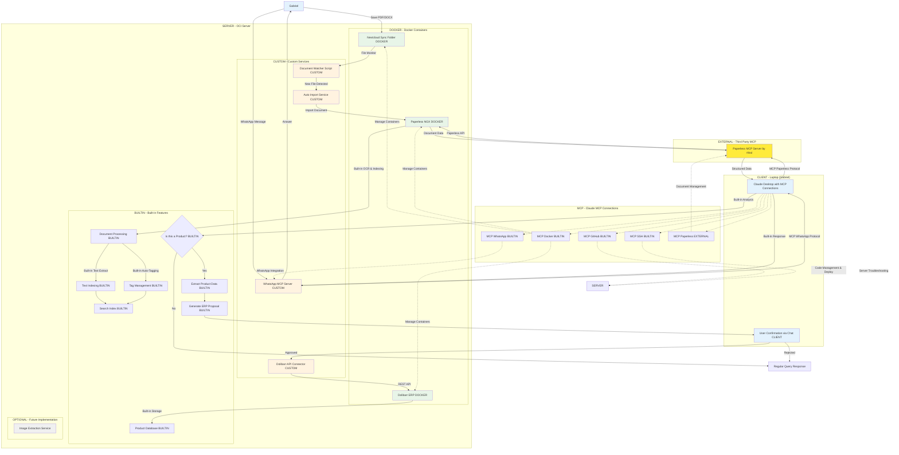

# NauticParts - AI-Powered Document Management System

An intelligent document management system for nautical parts with automated AI processing, built on Paperless NGX, Claude AI integration, and ERP synchronization.

## Architecture Overview

```
Gabriel ? Nextcloud ? Auto Processing ? Paperless NGX ? Claude AI (via MCP) ? Dolibarr ERP
             ?             ?             ?                      ?
       File Sync    Auto Import     OCR/Index              Product ID    ? WhatsApp
```

## Simplified Workflow Diagram



## Key Simplifications

### Using Existing Paperless MCP Server
Instead of building a custom webhook handler, we use **nloui/paperless-mcp** - a mature, feature-complete MCP server:

- **Installation**: `npm install -g paperless-mcp`
- **Configuration**: Simple Claude Desktop MCP config  
- **Functionality**: Full document management, search, upload, tagging
- **Maintenance**: Community-maintained, well-documented

### Image Extraction - Optional
Image extraction is marked as **optional/future enhancement** to focus on core functionality first.

### Workflow Legend

| Symbol | Component Type | Description |
|--------|---------------|-------------|
| CLIENT | **Client PC** | Gabriel's laptop with Claude Desktop |
| DOCKER | **Docker Containers** | Core applications on OCI server |
| CUSTOM | **Custom Services** | Python/Node.js scripts we develop |
| BUILTIN | **Built-in Features** | Native functionality of tools |
| EXTERNAL | **Third Party** | Existing MCP servers we use |
| OPTIONAL | **Future Features** | Later implementation |

## Core Development Scope

### Must Develop (CUSTOM)
1. **Document Watcher** - Monitor Nextcloud folder for new files
2. **Auto Import Service** - Copy files to Paperless consume folder  
3. **Dolibarr Connector** - Create products in ERP system
4. **WhatsApp MCP** - Enable WhatsApp communication

### Use Existing (EXTERNAL)
1. **Paperless MCP** - nloui/paperless-mcp for document management

### Built-in (No Development)
1. **Paperless NGX** - OCR, indexing, search
2. **Claude AI** - Document analysis, product recognition
3. **Dolibarr** - ERP functionality

## Quick Start

### 1. Install Paperless MCP Server
```bash
npm install -g paperless-mcp
```

### 2. Configure Claude Desktop MCP
Edit `~/Library/Application Support/Claude/claude_desktop_config.json`:

```json
{
  "mcpServers": {
    "paperless": {
      "command": "npx",
      "args": ["paperless-mcp", "http://your-oci-server:8000", "your-paperless-api-token"]
    },
    "docker": {
      "command": "docker-mcp-server",
      "args": ["--host", "your-oci-server"]
    },
    "whatsapp": {
      "command": "whatsapp-mcp-server",
      "args": ["--api-url", "http://your-oci-server:3001"]
    },
    "ssh": {
      "command": "ssh-mcp-server", 
      "args": ["--host", "your-oci-server"]
    }
  }
}
```

### 3. Deploy Core Services
```bash
git clone https://github.com/latinogino/nauticparts.git
cd nauticparts
cp .env.example .env
# Edit .env with your configuration
docker-compose up -d
```

## Usage Examples

### Document Management via Claude Desktop
- *"Search for documents containing 'marine bearing'"*
- *"Show me the latest nautical parts documentation"*
- *"Upload this product specification to Paperless"*
- *"List all documents tagged with 'engines'"*

### WhatsApp Queries
- *"Find documentation for part number 12345"*
- *"What engines do we have documentation for?"*
- *"Create a product proposal for this new pump"*

### Product Recognition Workflow
1. **Document Upload**: Save PDF/DOCX to Nextcloud
2. **Auto Processing**: Files automatically imported to Paperless
3. **AI Analysis**: Ask Claude *"Analyze the latest document for product information"*
4. **Product Creation**: *"Create this product in Dolibarr ERP"*

## Development Priorities

### Phase 1 - Core Functionality (Current Focus)
- ? Repository structure
- ? Docker Compose setup  
- ? Paperless MCP integration
- ? Document watcher implementation
- ? Auto import service
- ? Claude Desktop configuration

### Phase 2 - ERP Integration
- ? Dolibarr connector service
- ? Product creation workflow
- ? User confirmation interface

### Phase 3 - WhatsApp Integration  
- ? WhatsApp MCP server setup
- ? Bi-directional communication
- ? Natural language queries

### Phase 4 - Enhancements (Optional)
- ? Image extraction service
- ? Advanced product recognition
- ? Workflow automation

## Service Configuration

### Required Environment Variables

| Variable | Description |
|----------|-------------|
| `NEXTCLOUD_DB_PASSWORD` | Nextcloud database password |
| `PAPERLESS_DB_PASSWORD` | Paperless NGX database password |
| `PAPERLESS_SECRET_KEY` | Paperless NGX secret key (50+ chars) |
| `PAPERLESS_API_TOKEN` | Paperless NGX API token for MCP |
| `DOLIBARR_DB_PASSWORD` | Dolibarr database password |
| `DOLIBARR_ADMIN_PASSWORD` | Dolibarr admin password |
| `DOLIBARR_API_KEY` | Dolibarr API key |

### Service Endpoints

| Service | Port | Purpose |
|---------|------|---------|
| Nextcloud | 8080 | File management interface |
| Paperless NGX | 8000 | Document management |
| Dolibarr | 8090 | ERP interface |
| WhatsApp MCP | 3001 | WhatsApp communication |

## Benefits of Simplified Architecture

- **Faster Development** - Focus on 4 custom services instead of 6
- **Proven Components** - Use battle-tested Paperless MCP server
- **Maintainability** - Less custom code to maintain
- **Reliability** - Leverage community-supported solutions
- **Scalability** - Easy to add image extraction later

## Support

- [Documentation](./docs/)
- [Issues](https://github.com/latinogino/nauticparts/issues)
- [Discussions](https://github.com/latinogino/nauticparts/discussions)

## License

MIT License - see [LICENSE](LICENSE) for details.

---

**NauticParts** - Streamlining nautical parts management with AI-powered automation.